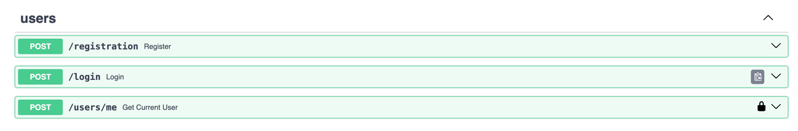
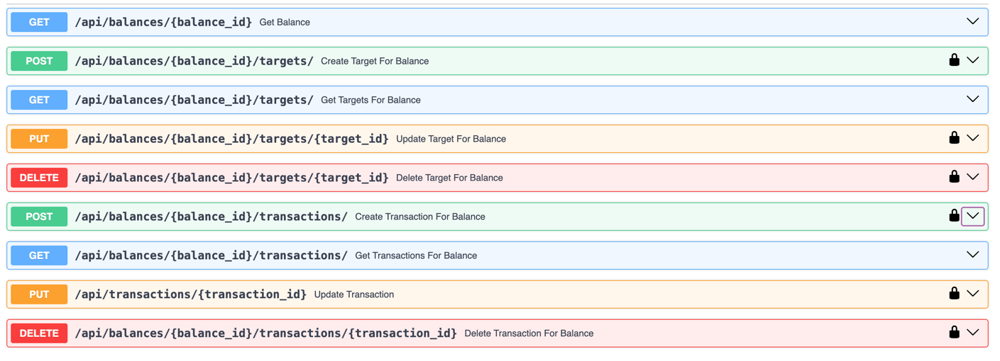
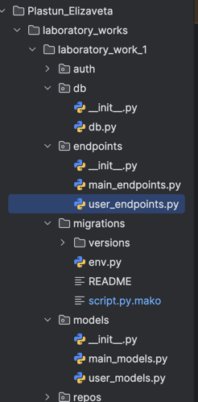

# Отчет по лабораторной работе №1

Для работы будет использоваться следующий стек: fastapi sqlmodel uvicorn alembic

На первом шаге инициализируем приложение и подключаем базу данных:

```
import uvicorn
from fastapi import FastAPI
from sqlmodel import SQLModel

from db.db import engine
from endpoints.user_endpoints import user_router
from endpoints.main_endpoints import main_router
from models.user_models import *

app = FastAPI()

app.include_router(user_router)
app.include_router(main_router, prefix="/api")


def create_db():
    SQLModel.metadata.create_all(engine)

if __name__ == '__main__':
    uvico
```
```
from sqlmodel import create_engine, Session
import os
from dotenv import load_dotenv

load_dotenv()
postgres_url = os.getenv('DB_URL')

db_url = postgres_url
engine = create_engine(db_url, echo=True)
session = Session(bind=engine)
```

Создаем модели данных для бд, в них будет входить: пользователь, баланс, транзакции и цели, также будет создан enum для категорий

```
class TransactionsType(str, Enum):
    INCOME = "income"
    EXPENSES = "expenses"


class TargetDeafult(SQLModel):
    category: Category = Category.OTHER
    value: int = 0
    balance_id: int = Field(foreign_key="balance.id")
class Target(TargetDeafult, table=True):
    id: int = Field(primary_key=True)
    balance: Optional["Balance"] = Relationship(back_populates="targets")

class Transactions(SQLModel, table=True):
    id: int = Field(primary_key=True)
    category: Category = Category.OTHER
    value: int = 0
    type: TransactionsType = TransactionsType.INCOME
    balance_id: int = Field(foreign_key="balance.id")
    balance: Optional["Balance"] = Relationship(back_populates="transactions")

class BalanceDeafult(SQLModel):
    balance: int = 0
    user_id: Optional[int] = Field(foreign_key="user.id")

class Balance(BalanceDeafult, table=True):
    id: int = Field(primary_key=True)
    user: Optional[User] = Relationship(back_populates="balance")
    transactions: List[Transactions] = Relationship(back_populates="balance")
    targets: List[Target] = Relationship(back_populates="balance")


class UserBalance(BalanceDeafult):
    transactions: List[Transactions] = None
    targets: List[Target] = None
    test: int = 0
    #delite


class TargetResponse(TargetDeafult):
    balance: Optional[Balance] = None

class TargetCreate(SQLModel):
    category: Category
    value: int


class TargetUpdate(SQLModel):
    category: Category
    value: int


class TransactionsCreate(SQLModel):
    category: Category
    type: TransactionsType
    value: int


class TransactionsUpdate(SQLModel):
    category: Category
    type: TransactionsType
    value: int
```
Также создаем модель пользователя:
```
class User(SQLModel, table=True):
    id: int = Field(primary_key=True)
    username: str = Field(index=True)
    password: str
    email: str
    balance: Optional["Balance"] = Relationship(back_populates="user")
    created_at: datetime.datetime = Field(default=datetime.datetime.now())
```
Теперь добавляем эндпоинты для авторизации
```
@user_router.post('/registration', status_code=201, tags=['users'], description='Register new user')
def register(user: UserInput):
    users = select_all_users()
    if any(x.username == user.username for x in users):
        raise HTTPException(status_code=400, detail='Username is taken')
    hashed_pwd = auth_handler.get_password_hash(user.password)
    balance = Balance(balance=0)
    u = User(username=user.username, password=hashed_pwd, email=user.email, balance=balance)
    session.add_all([u, balance])
    session.commit()

    return JSONResponse(status_code=201, content={"message": "User registered successfully"})

@user_router.post('/login', tags=['users'])
def login(user: UserLogin):
    user_found = find_user(user.username)

    if not user_found:
        raise HTTPException(status_code=401, detail='Invalid username and/or password')
    verified = auth_handler.verify_password(user.password, user_found.password)

    if not verified:
        raise HTTPException(status_code=401, detail='Invalid username and/or password')

    token = auth_handler.encode_token(user_found.username)
    return {'token': token}


@user_router.post('/users/me', tags=['users'])
def get_current_user(user: User = Depends(auth_handler.get_current_user)):
    return user.username
```


Добавляем CRUD операции для целей и транзакций, а также эндпоинты для получения данных о транзакции и цели по балансу

Также подключаем систему миграций используя библиотеку alembic

# Вывод
В ходе работы было написано API с авторизацией и CRUD-операциями на фреймворке FastAPI