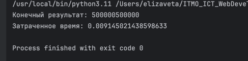
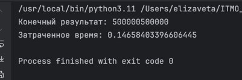
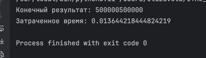
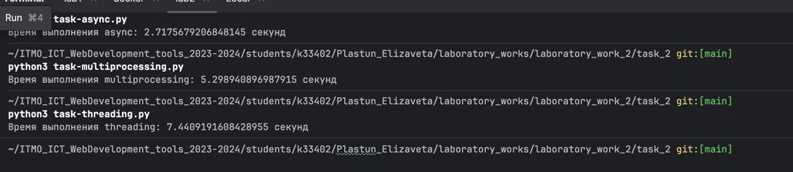

# Отчет по лабораторной работе №2

Для тестирования была написана функция для подсчета суммы чисел в отрезке и созданы функции вызывающие эту функцию для отрезков с указанным шагом. Таким образом мы добились того, что подсчет суммы будет разделен на несколько задач, которые можно будет выполнять с применением различных подходов асинхронного программирования на python.

Результат выполнения с помощью asyncio

Результат выполнения с помощью multiprocessing

Результат выполнения с помощью threding

для задачи 2 был написан код для парсинга книг с сайта буквоеда
