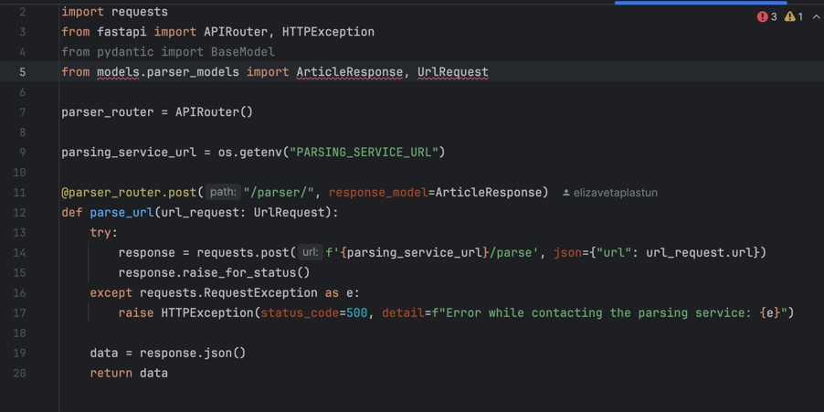
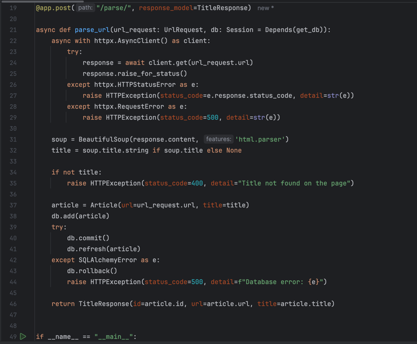
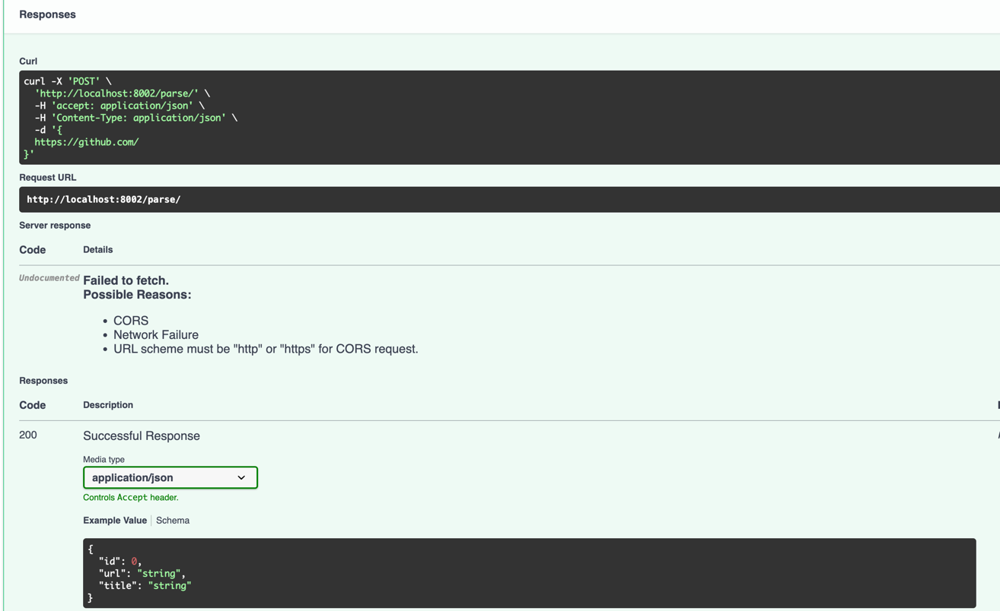
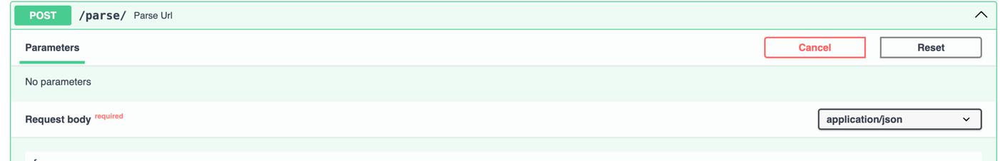
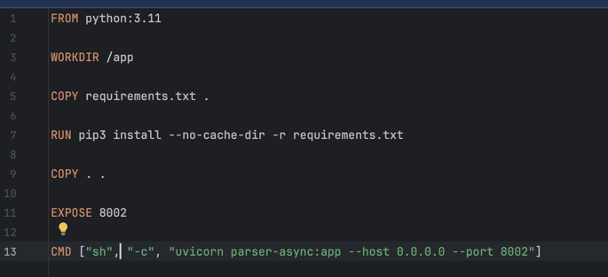
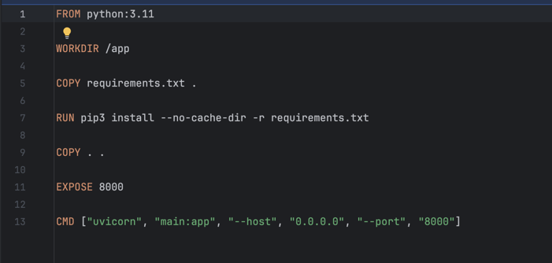
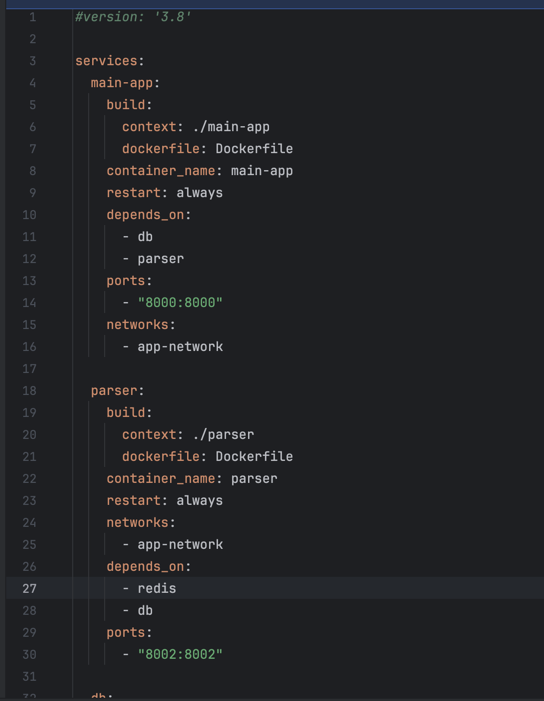

# Отчет по лабораторной работе №3
Сачала переносим 1 и 2 лабораторную работу в новый проект. 1 работа будет основой для главного сервиса, а 2 будет
использоваться как микросервис для асинхронного парсинга страниц

В основном приложении добавляем новый роут по которому будем обращаться к микросервису и передавать url

В микросервисе добавляем функцию для обработки запроса

Проверяем работу

Теперь в каждый сервис добавляем Dockerfile

И в корне проекта добавляем docer-compose файл для запуска всех необходимых образов

